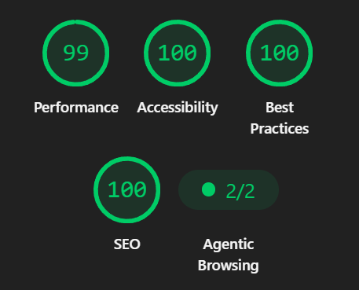
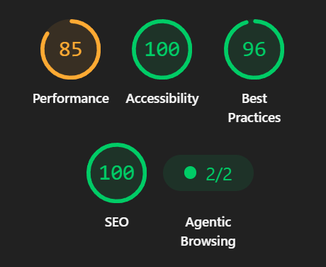

# 🍹 Wizardry Drinks — Landing Page Imersiva & Performance Front-End

[](https://reactjs.org/)
[](https://greensock.com/gsap/)
[](https://tailwindcss.com/)
[](https://vitejs.js.org/)
[](https://developers.google.com/web/tools/lighthouse)

Landing page de alta fidelidade visual para a **Wizardry Drinks**. O objetivo do projeto foi alinhar uma experiência de usuário imersiva (animações avançadas com GSAP e máscaras CSS) com **excelência em performance web, SEO e acessibilidade (Google Lighthouse)**.

🔗 **[Acesse a Aplicação Online](https://leonardo-arantes-oliveira.github.io/wizardry-drinks/)**

---

## ⚡ Performance & Otimização (Lighthouse)

Desenvolver animações complexas mantendo alta taxa de quadros (60 FPS) e carregamento instantâneo exige otimização rigorosa de assets e ciclo de vida de renderização.

| Desktop (Performance 99%) | Mobile (Performance 85%) |
| :---: | :---: |
|  |  |

## 🔬 Engenharia de Performance, Memória e Adaptação Contextual

Para garantir uma taxa de quadros estável (**60 FPS**) durante interações complexas de manipulação de DOM e transformações de layout por rolagem, foram aplicadas estratégias avançadas de **gerenciamento de recursos, otimização de renderização e adaptação dinâmica**.

### 1. Desbloqueio da Main Thread & Carregamento Condicional Diferenciado
- **Adaptabilidade Contextual por Hardware (Desktop vs. Mobile):** Utilização de consultas dinâmicas de mídia (*Media Queries*) via hooks reativos para interceptar a capacidade e as dimensões do dispositivo antes da montagem da árvore de animação. Em ambientes móveis, os gatilhos visuais, profundidades de vetor e escalonamento de máscaras (*mask-scaling*) são parametrizados defensivamente para reduzir o custo computacional no *pipeline* de renderização do navegador.
- **Payload Diferenciado & Formatos de Próxima Geração:** Pipeline de assets otimizado com compressão adaptativa e entrega de imagens no formato **WebP**, minimizando o tempo de bloqueio de renderização (*Render-Blocking*) e o *Largest Contentful Paint (LCP)*.

### 2. Ciclo de Vida do GSAP & Prevenção Rigorosa de Memory Leaks
- **Isolamento de Contexto & Garbage Collection:** Implementação do padrão `useGSAP` para encapsular todas as instâncias de `gsap.timeline()` e `ScrollTrigger`. Isso garante o registro preciso de seletores e o **cleanup atômico** (desalocação de escutadores de eventos de rolagem e mutações de DOM) durante a desmontagem (*unmount*) do componente React, erradicando vazamentos de memória (*memory leaks*) e acúmulo de instâncias órfãs na V8.
- **Aceleração por Hardware & Transformações Composited:** Uso estrito de propriedades CSS aceleradas pela GPU (`scale`, `opacity`, `transform`) e máscaras vetoriais (`mask-image`), evitando operações custosas de *Reflow* (Layout) e restringindo as atualizações apenas à etapa de *Composite*.

### 3. Métricas de Qualidade de Software (Google Lighthouse)
As decisões de arquitetura técnica refletem-se diretamente nos *Key Performance Indicators* (KPIs) auditados via Lighthouse:

---

## 🛠️ Tecnologias & Arquitetura

- **React.js:** Estruturação modular em componentes de alta reuso.
- **GSAP & ScrollTrigger:** Linhas do tempo encadeadas, pinning de seções e efeito de revelação por máscara SVG/CSS (`mask-image` / `mask-size`).
- **Tailwind CSS:** Estilização responsiva e padronizada.

---

## 🚀 Como Executar Localmente

```bash
# Clone o repositório
git clone [https://github.com/leonardo-aranha-oliveira/drinks.git](https://github.com/leonardo-aranha-oliveira/drinks.git)

# Acesse a pasta do projeto
cd drinks

# Instale as dependências
npm install

# Execute o servidor de desenvolvimento
npm run dev